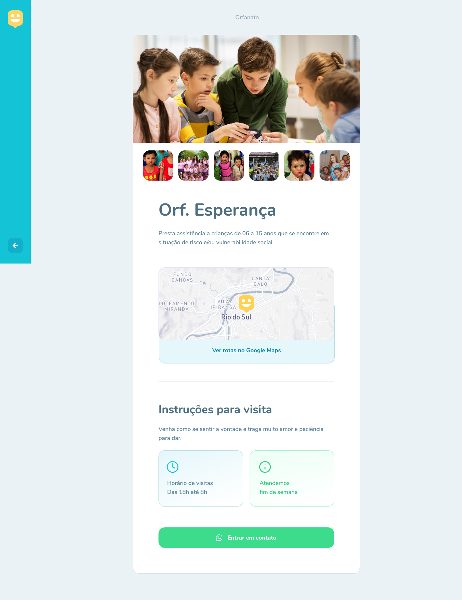

<div align="center">
  
</div>

##  Sobre o projeto
O *Happy* é uma aplicação para levar felicidade através da disponibilização de casas de acolhimento institucional. 
Nele você encontra as informações necessárias para tornar o dia de uma criança mais feliz purple_heart

## Layout

<div align="center">
  
  
  
  
</div>

## 🚀 Tecnologias

-  [Yarn](https://yarnpkg.com/)
-  [Node.js](https://nodejs.org/en/)
-  [Typescript](https://www.typescriptlang.org/)
-  [ReactJS](https://reactjs.org/)
-  [React Native](http://facebook.github.io/react-native/)
-  [Expo](https://expo.io/)

### Install API 

```bash
# Clone this repository
$ https://github.com/mauriciogirardi/Happy.git

# Go into the repository
$ cd Happy/backend

# Install dependencies
$ yarn install

# Run Migrates
$ yarn typeorm migration:run

# Start server
$ yarn dev

# running on port 3333
```

### Install Front-end

```bash
# Clone this repository
$ https://github.com/mauriciogirardi/Happy.git

# Go into the repository
$ cd Happy/web

# Install dependencies
$ yarn install

# Run
$ yarn start

# running on port 3000
```

## 📝 Licença

Esse projeto possui a licença MIT. Veja no arquivo [LICENSE](LICENSE.md) para mais informações.

<h4>Feito com ♥ by Mauricio Girardi</h4>
